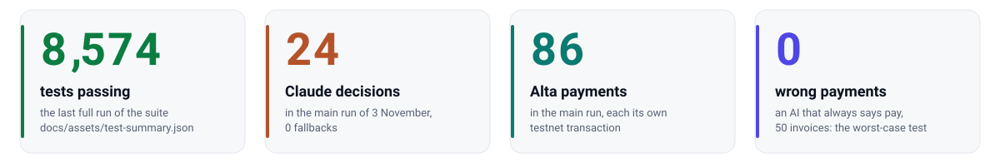
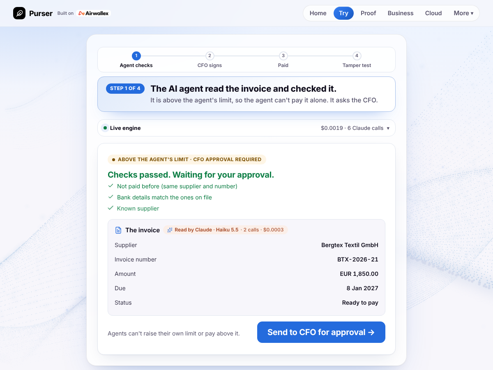
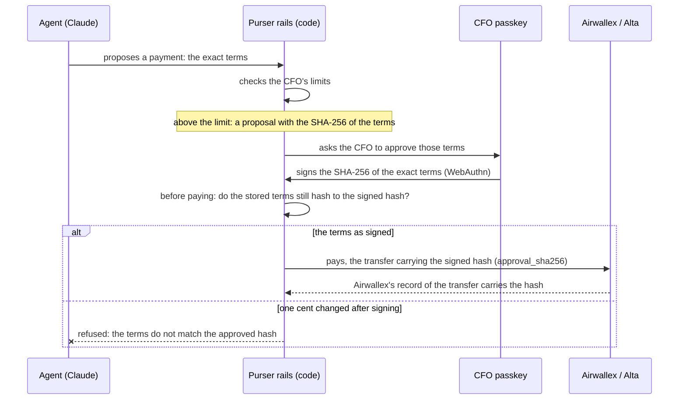
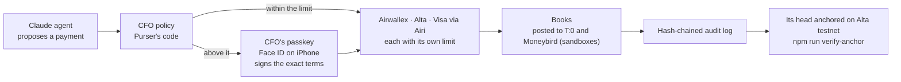

<div align="center">

<a href="https://kit11.max-31b.workers.dev/"><picture><source media="(prefers-color-scheme: dark)" srcset="docs/assets/readme/banner-dark.png"></picture></a><br><picture><source media="(prefers-color-scheme: dark)" srcset="docs/assets/hero/flow-dark.svg"></picture>

# Purser · AI agents spend. You sign off.

**Build & quality**<br>[](https://github.com/agamemnon-coder/x402-business-agents/actions/workflows/ci.yml?query=branch%3Amain)&nbsp;[](https://github.com/agamemnon-coder/x402-business-agents/actions/workflows/github-code-scanning/codeql)&nbsp;[](docs/assets/test-summary.json)&nbsp;[](docs/evidence/coverage.md)&nbsp;[](LICENSE)<br><br>
**Security & supply chain**<br>[](https://www.bestpractices.dev/projects/16923)&nbsp;[](https://scorecard.dev/viewer/?uri=github.com/agamemnon-coder/x402-business-agents)&nbsp;[](REUSE.toml)&nbsp;[](docs/security/README.md#verify-a-release)&nbsp;[](docs/evidence/formal-model.md)&nbsp;[](docs/evidence/formal-proofs.md)<br><br>
**Product & partners**<br>[](https://kit11.max-31b.workers.dev/airwallex)&nbsp;[](https://kit11.max-31b.workers.dev/alta)&nbsp;[](https://kit11.max-31b.workers.dev/visa)&nbsp;[](https://kit11.max-31b.workers.dev/t0)&nbsp;[](https://kit11.max-31b.workers.dev/claude)&nbsp;[](docs/worst-case-ai.md)&nbsp;[](#try-it-in-2-minutes)&nbsp;[](#built-with)

**AI agents pay your suppliers. Above their limit, you sign the exact terms with your passkey, and one changed cent breaks the signature.**

**1. [Watch the demo (3:15)](https://youtu.be/gEUm8RlhZac) · 2. [Try it (2 min, test money)](https://kit11.max-31b.workers.dev/try) · 3. [Verify a payment (3 commands)](#verify-it-yourself-in-3-commands)**

<a href="https://youtu.be/gEUm8RlhZac"></a>

<a href="https://kit11.max-31b.workers.dev/proof#evidence"><picture><source media="(prefers-color-scheme: dark)" srcset="docs/assets/readme/evidence-map-dark.svg"></picture></a>

**Evidence wall, from the records:** All 60 soak payments read back · All 116 /try payouts PAID · All 894 forged copies refused · 71 Airwallex endpoints live · [every figure, with its record](https://kit11.max-31b.workers.dev/proof#evidence) · [the index of /proof's figures](docs/evidence/proof-index.md)

**What it is:** the control layer between a company's AI agents and its money on Airwallex and Alta (formerly Metal): one engine runs agents that pay supplier invoices and agents that buy and sell data over x402, hence the repository's name, x402-business-agents, after Starter Kit 11 ("x402 Business Agents"), the hackathon brief it was built for.

| **The strongest proof, one click each** (test money) | Check it |
|---|---|
| **1 · Try it live:** the agent pays EUR 120.00 alone; you sign EUR 1,850.00 with a passkey; one cent changed is refused | [/try](https://kit11.max-31b.workers.dev/try) |
| **2 · x402 business agents on Alta (formerly Metal):** agents buy and sell data over x402 under on-chain mandates; main run of 3 Nov: 86 Alta payments, purchase #24 refused on chain (Purser's own check off for that one purchase) | [/alta](https://kit11.max-31b.workers.dev/alta) · [run](docs/runs/2026-11-03-main-run.md) |
| **3 · The CFO's signature inside Airwallex's own record:** the transfer carries the hash of the signed terms in `metadata.approval_sha256`, read back from Airwallex on 6 Nov | [record](docs/runs/airwallex-transfer-approval-2026-11-06.json) |
| **4 · A payout that fails after PAID goes to a person:** Airwallex sandbox, 17 Nov, two PAID payouts failed by its simulation endpoint; nothing was sent again | [record](docs/runs/2026-11-17-airwallex-late-failure.json) |
| **5 · 0 wrong payments** with an AI that always says pay, against 35 for a payer with no rules (50 cases, offline eval) | [eval](docs/worst-case-ai.md) |
| **6 · For the CFO:** invoice to month-end, measured per invoice | [finance](docs/finance-value.md) |

| **For judges:** the four things every entry shows, and where every id is | Check it |
|---|---|
| **User:** a CFO whose AI agents pay suppliers; above an agent's limit, the CFO signs | [/try](https://kit11.max-31b.workers.dev/try) |
| **Airwallex action:** a SWIFT transfer that carries the hash of the signed terms in `metadata.approval_sha256` (main run of 3 Nov, read back from Airwallex on 6 Nov) | [record](docs/runs/airwallex-transfer-approval-2026-11-06.json) |
| **Financial context:** the agent spends only what is available (balance − holds − payouts in flight), above a cash floor; FX buys only the shortfall | [available.ts](src/policy/available.ts) · [treasury.ts](src/policy/treasury.ts) |
| **Controls:** per-agent limits; a passkey over the exact terms; duplicates held; a payout that fails after PAID goes back to a person | [approvals.ts](src/policy/approvals.ts) · [euroBill.ts](src/agents/euroBill.ts) · [follow.ts](src/payouts/follow.ts) |
| **Proof:** one id per rail, and every run with its record, live or simulated | [one id per rail](docs/in-depth.md#what-ran-live-one-id-per-rail) · [every run](docs/runs/README.md) · [/proof](https://kit11.max-31b.workers.dev/proof) |

**What stood at the submission:** the tag `v1.0-submission` (8 Nov), Purser's entry to the Airwallex Agentic Banking Hackathon (entered for the Founder's Choice Award, the Judges' Choice Award, the Metal Award and the Visa Award), holds the Kit 11 main run of 3 Nov and /try/sign; the payables inbox (`src/ap/`), Purser Cloud and today's /try came after, with run records dated 10 to 17 Nov ([CHANGELOG.md](CHANGELOG.md), [v1.1 notes](docs/releases/v1.1-submission.md)).

<a href="https://kit11.max-31b.workers.dev/proof"><picture><source media="(prefers-color-scheme: dark)" srcset="docs/assets/readme/proof-strip-dark.svg"></picture></a>

</div>

> [!IMPORTANT]
> **Test money only.** Live: calls to the Airwallex sandbox, Alta testnet, Visa via Airi (sandbox), the T:0 sandbox ledger and Claude. Simulated: the customer, the supplier, the merchants' charges, the settlement and the second approver.

**Words used here:**
- **VIC, Airi:** Visa Intelligent Commerce (VIC) through Airwallex's Airi: an agent pays with a Visa credential from Airi that Purser binds to one purchase (sandbox, test card).
- **T:0:** an outside general ledger; Purser posts its books to T:0's shared sandbox entity and reads them back, account by account.
- **/try/sign:** the hands-on page at the submission tag, where you sign with your own passkey; today's [/try](https://kit11.max-31b.workers.dev/try) came after it.
- **Purser Cloud:** the console with the demo company's dashboard and books, its API, /try's engine and the MCP server, on Cloudflare Workers.

## At a glance

<picture><source media="(prefers-color-scheme: dark)" srcset="docs/assets/readme/stats-dark.svg"></picture>

- **The agent trace, live:** on [/try](https://kit11.max-31b.workers.dev/try), each Claude call, its lookups and its decision, as the engine recorded them ([record](docs/evidence/try-agentic-2026-11-15/README.md)).
- **Agents negotiate:** on [/try](https://kit11.max-31b.workers.dev/try) (the Clean invoice) and [/try/negotiate](https://kit11.max-31b.workers.dev/try/negotiate), two Claude agents agree a deal; code holds the limits, you sign it ([the rails](src/negotiate/rails.ts)).
- **The worst-case AI test (offline eval, test data):** a script that always says pay made 0 wrong payments; a payer with no rules made 35 ([docs/worst-case-ai.md](docs/worst-case-ai.md), [record](docs/evals/worst-case-summary.json)).
- **Airwallex declines one cent over, live (15 Nov):** EUR 30.00 approved, EUR 30.01 declined, `LIMIT_EXCEEDED` (charges simulated; the decline is Airwallex's) ([record](docs/runs/airwallex-card-cent-2026-11-15.json)).
- **The Airwallex sandbox calls in the run records**, listed with what came back and its record: [/airwallex/calls](https://kit11.max-31b.workers.dev/airwallex/calls).
- **Verify it yourself:** [/verify](https://kit11.max-31b.workers.dev/verify) checks a /try payment in your browser; the live report: 189 checks passed, 3 could not run here, 0 failed ([report](docs/evidence/verification-2026-11-15.md)).

## Kit 11, step by step

The Kit 11 scenario, run live on 3 November. The brief's eight steps, what Purser does in each, and one proof each from that main run: [docs/kit11.md](docs/kit11.md).

**One engine, two jobs.** In the Kit 11 run, the agents Sourcing, Support and Treasury bought and sold data over x402 on Alta testnet; the payables agents (Reader, Checker, Coder, Payer) pay supplier invoices through Airwallex. Both run under the same CFO limits, the same passkey and the same books.

An approval is usually a button. In Purser it's a signature over the exact terms: change one cent and it's worthless.

**Live demo: [kit11.max-31b.workers.dev/try](https://kit11.max-31b.workers.dev/try)**: a test company of your own on test money, in 2 minutes · [the demo (3:15)](https://youtu.be/gEUm8RlhZac) · [every id on /proof](https://kit11.max-31b.workers.dev/proof)

## Verify it yourself in 3 commands

The quick start: under 2 minutes, no keys. Needs Node.js 22.13+ (or 23.4+) and git. `npm ci` downloads packages from npm; after that, no network and no keys.

```sh
npm ci                       # under a minute: the exact versions in the lockfile
npm run judge -- --check     # about 5 s: every page in CHECK_PATHS built from the main run's record, offline
npm run verify-approval      # under 1 s: the owner's real passkey approval of 7 November, checked with Node's crypto
```

<p align="center"></p>

> [!NOTE]
> **Verify it yourself, offline:** `npm run verify-approval` checks the real approval; change one cent in a copy and `npm run verify-receipt -- tampered.json` says NOT VALID. Below, the real output of both.

<picture><source media="(prefers-color-scheme: dark)" srcset="docs/assets/readme/terminal-verify-dark.svg"></picture>

<details><summary>What you should see (abridged)</summary>

```text
ok    /  200  63106 bytes
ok    /proof  200  138535 bytes
…
ok    signature          the ES256 signature verifies with the receipt's public key

VALID: docs/runs/2026-11-07-awx-1/receipt-P-0002.json
Proves: the holder of this public key signed exactly these terms, with the authenticator reporting user verification, on this site.
Does not prove: who holds the key, or that it was Face ID (no attestation is checked). A test world's terms: nothing real moved.
```

</details>

`npm run verify-receipt -- receipt.json`
checks any receipt of the same format. `npm run airwallex-trail` lists the Airwallex sandbox API calls in the run records it reads and re-checks, offline, that each transfer carries the hash the passkey signed (exit 1 on any mismatch; the same list is on [/airwallex/calls](https://kit11.max-31b.workers.dev/airwallex/calls)). Pay on [/try](https://kit11.max-31b.workers.dev/try), download the proof (JSON), and check it on [/verify](https://kit11.max-31b.workers.dev/verify) in your browser, or with `npm run verify-bundle -- purser-proof.json`: the same checks, the same code, no server ([samples](docs/proof/)).

The full suite, `npm test` (about 8 to 9 min on a laptop): **8845 tests passing**, 5 skipped, in 814 files (the last full run, on commit `1ef28d9fa`: [summary](docs/assets/test-summary.json)), on stand-ins for Airwallex, Alta and Claude. The skipped ones run only on local D1 (`npm run test:d1`). Two kinds of line in its output are expected noise, not failures: Node's "ExperimentalWarning: SQLite is an experimental feature" and "try-sign: a live agent call failed" (a test that checks the fallback when the model is down).

`npm run test-count` writes that count from the last full run; `npm run test:coverage` measures coverage per area. CI runs these checks on every push, with CodeQL and gitleaks; the CI badge at the top shows the result of the latest run on main.

## Where things are

| Folder | What it holds |
|---|---|
| `src/` | Purser itself: the agents, the policy and its checks, the rails (Airwallex, Alta, Visa via Airi), the ledger |
| `cloud/` | Purser Cloud on Cloudflare Workers: the console, its API, /try and the engine |
| `worker/` | The public site's Worker (kit11): the pages and the relay for the dashboard and passkey approvals |
| `docs/` | The runs and their records (`docs/runs/`: ids, amounts, timestamps), the long description, security, claims |
| `test/` | The tests (`npm test`, vitest) and the browser checks (`test/browser/`) |
| `contracts/` | The Solidity contracts used on Alta testnet, with their ABIs |
| `examples/` | The Dispute desk, reusable by any seller on Alta |
| `scripts/` | Charts, changelog and other generators |

## Watch it

**[The demo (3:15)](https://youtu.be/gEUm8RlhZac)**, the video in the submission (its thumbnail is at the top) · test money only

Earlier videos: [the film, under the hood (3:29)](https://youtu.be/PNLuqhRzVfE) · [the trailer (1:30)](https://youtu.be/n3HLVGROJc4) · test money only

## Airwallex at the centre

**Built on Airwallex.** Purser calls Airwallex's API for a card per agent with the CFO's limits (Issuing), FX quotes inside the signed terms, transfers that carry the hash the CFO signed, the payee's bank check, Airwallex's own approval as a second lock, and signed webhooks (the sandbox, test money: [docs/airwallex.md](docs/airwallex.md)).

The live FX quote in the signed terms, the sandbox transfer, the Cloud's Airwallex tab, the signed events and the agent cards: [docs/airwallex-centre.md](docs/airwallex-centre.md).

What the sandbox taught us: eight things we ran into in Airwallex's API, what we did about each, and what we would ask for ([docs/feedback-for-metal-and-airwallex.md](docs/feedback-for-metal-and-airwallex.md#airwallex)).

## How it works

| 1 · The agent asks | 2 · Code checks the limit | 3 · You sign the exact terms |
|---|---|---|
| A Claude agent proposes a payment: an invoice, a card charge, an x402 purchase. | Within the CFO's limits it pays alone; Airwallex and Alta hold the limit again. | Above them, the CFO's passkey (Face ID on iPhone) signs the SHA-256 of the exact terms. |

**Above your limit: not signed, never paid.**

- **A passkey signs the exact terms.** The approval is a signature over the SHA-256 of the terms; change one cent and it no longer verifies. The owner's real approval of 7 November is checked offline by `npm run verify-approval` ([record](docs/runs/2026-11-07-awx-1.md)).
- **Limits are enforced in 3 layers: Purser's code, Airwallex's card controls and Alta's on-chain mandate.** Airwallex itself declined an agent's card over the CFO's limit ([record](docs/runs/2026-11-07-awx-1.md)); Alta refused a purchase over the mandate on chain ([record](docs/runs/2026-11-03-main-run.md)). The mandates: [/api/metal/mandates](https://kit11.max-31b.workers.dev/api/metal/mandates), a live read from Alta testnet, or the recorded 12 Nov snapshot when the chain does not answer (the answer says which).
- **The audit chain is anchored on chain.** Every event goes into a hash-chained log; its head is in a value-0 Alta testnet transaction, and `npm run verify-anchor` prints MATCH ([record](docs/runs/2026-11-13-anchor.md); run live again on 15 Nov: MATCH, [record](docs/runs/2026-11-15-anchor-verified.md)).

**Run live on test money** (Alta testnet, Airwallex sandbox, Visa via Airwallex Airi (sandbox), Claude): the main run of 3 November (24 decisions by Claude, 86 Alta payments, 16 stops, nothing paid over a limit) and 33 live runs up to 19 Nov, every id on [/proof](https://kit11.max-31b.workers.dev/proof), every figure on its [evidence wall](https://kit11.max-31b.workers.dev/proof#evidence).

Airwallex's AgentOS says its "components do not initiate money-out actions (transfers, FX conversions, or payouts) on
your behalf" ([docs](https://www.airwallex.com/docs/developer-tools/ai/agentos), read 13 November 2026). Purser is the control layer for when agents do move money on Airwallex: within limits the CFO signs, and above them only with the CFO's passkey on the exact terms.

### One payment, step by step

The approval path in [src/policy/approvals.ts](src/policy/approvals.ts) and the Airwallex transfer in [src/airwallex/adapter.ts](src/airwallex/adapter.ts):


```mermaid
sequenceDiagram
  participant A as Agent (Claude)
  participant P as Purser rails (code)
  participant C as CFO passkey
  participant X as Airwallex / Alta
  A->>P: proposes a payment: the exact terms
  P->>P: checks the CFO's limits
  Note over P: above the limit: a proposal with the SHA-256 of the terms
  P->>C: asks the CFO to approve those terms
  C->>P: signs the SHA-256 of the exact terms (WebAuthn)
  P->>P: before paying: do the stored terms still hash to the signed hash?
  alt the terms as signed
    P->>X: pays, the transfer carrying the signed hash (approval_sha256)
    X-->>P: Airwallex's record of the transfer carries the hash
  else one cent changed after signing
    P--xA: refused: the terms do not match the approved hash
  end
```

## Architecture

<picture><source media="(prefers-color-scheme: dark)" srcset="docs/assets/readme/system-map-dark.svg"></picture>

*The whole system at a glance: everything here is built and runs on test money; open the image for full size.*

<details><summary>More diagrams: the four layers, where it runs, the flow of a payment</summary>

<picture><source media="(prefers-color-scheme: dark)" srcset="docs/assets/readme/architecture-dark.svg"></picture>

- **CFO & company:** /try, the Purser Cloud console and /verify; the CFO's passkey signs the SHA-256 of the exact terms.
- **Purser engine:** Claude agents propose (Reader, Checker, Sourcing, Support, Treasury); the CFO policy, the terms hash and the hash-chained audit log decide in code. One cent changed: refused.
- **Payment rails:** the Airwallex sandbox (cards, transfers, FX), Alta testnet (a mandate per agent) and Visa Intelligent Commerce via Airwallex Airi; each holds its own limit.
- **Proof:** the log's head anchored on Alta, the T:0 read-back, proof files anyone can check, `npm run verify-all`.
- **Where it runs:** two Cloudflare Workers with Durable Objects and D1; keys are Worker secrets; deployed by hand with wrangler, while CI only checks ([docs/architecture.md](docs/architecture.md#where-it-runs)).

<picture><source media="(prefers-color-scheme: dark)" srcset="docs/assets/readme/deployment-dark.svg"></picture>


```mermaid
flowchart LR
  A["Claude agent<br/>proposes a payment"] --> P["CFO policy<br/>Purser's code"]
  P -- "within the limit" --> R["Airwallex · Alta · Visa via Airi<br/>each with its own limit"]
  P -- "above it" --> F["CFO's passkey<br/>Face ID on iPhone<br/>signs the exact terms"]
  F --> R
  R --> B["Books<br/>posted to T:0 and Moneybird (sandboxes)"]
  B --> L["Hash-chained audit log"] --> N["Its head anchored on Alta testnet<br/>npm run verify-anchor"]
```

</details>

<details><summary>Where each part lives in the code</summary>

| Path | What it does |
|---|---|
| `src/claude/reader.ts`, `src/ap/read.ts` | The Claude reader (Haiku, Sonnet, Opus) and the Reader of invoices |
| `src/ap/checkerAgent.ts` | The Checker: pay, ask the CFO, hold or reject; code enforces it |
| `src/agents/` | Sourcing, Support, Treasury and the other agents |
| `src/policy/rules.ts`, `src/policy/cardRules.ts` | The CFO policy, and its limits as Airwallex card controls |
| `src/lib/terms.ts`, `src/policy/approvals.ts`, `src/passkey/` | The terms hash, the approvals, the passkey checks |
| `src/audit/log.ts` | The hash-chained audit log |
| `src/negotiate/` | The negotiation: two Claude agents, rails in code |
| `src/airwallex/`, `src/metal/`, `src/airi/` | The rails: Airwallex sandbox, Alta testnet, Visa via Airi |
| `src/anchor/`, `src/accounting/t0.ts`, `src/proof/bundle.ts`, `src/cli/verifyAll.ts` | The anchor, T:0, the proof file, verify-all |
| `worker/wrangler.jsonc` | Worker kit11: the site, the relay, the Airwallex entrypoints |
| `cloud/wrangler.try.jsonc` | Worker purser-try: the console, /try's engine, /mcp, D1 |
| `.github/workflows/ci.yml` | CI: tests, browsers, secrets scan, security; no deploy |

</details>

### Invariants: what holds even if the AI is wrong

| Invariant | How the code holds it |
|---|---|
| **Intent integrity** | The passkey signs the SHA-256 of the canonical terms (keys sorted, money as decimal strings); one changed cent fails the check before any rail is called ([src/policy/approvals.ts](src/policy/approvals.ts)). |
| **No keys for agents** | Claude agents and the MCP server read and propose; they hold no payment credentials and cannot approve. |
| **No double payment** | A payout's request_id is fixed before payment; a lost answer is resolved by looking that id up, never by a blind resend ([src/executors/invoicePayment.ts](src/executors/invoicePayment.ts)). |
| **Tamper-evident log** | Every decision is hash-chained, and the chain's head is anchored on Alta testnet (`npm run verify-anchor`). |
| **The payee's bank checks the name** | Before a new supplier or changed bank details reach the CFO, Airwallex's account verification (`POST /beneficiaries/verify_account`) must match: a mismatch is refused, a partial match held (live, 12 Nov: [run](docs/runs/2026-11-12-airwallex-payee-check.md)). |
| **Money spoken for before it moves** | Available = balance − holds − payouts under way, the same everywhere, so two payments never count on the same euro ([src/policy/available.ts](src/policy/available.ts)). |
| **A payout that comes back** | PAID is not final at Airwallex: a `payout.transfer.failed` webhook gets the payout read again; the invoice goes to a person, the books take the payment back (the fee stays, Airwallex keeps it), and nothing is sent again under the old approval ([src/payouts/follow.ts](src/payouts/follow.ts)). Sandbox, 17 Nov: two PAID payouts failed by the simulation endpoint, a read of each in place of the webhook; both invoices went to a person, nothing was sent again ([record](docs/runs/2026-11-17-airwallex-late-failure.json)). The books taking a payment back: tested only. |

## Built with

| Partner | What Purser uses | Live or simulated | Proof |
|---|---|---|---|
| **Airwallex** (sandbox) | agent cards and limits, FX, SWIFT payouts, its approval as a second lock, the payee name check | Sandbox, live calls; SWIFT settlement simulated through the sandbox's simulation API | [the card decline](docs/runs/2026-11-07-awx-1.md), [two locks](docs/runs/2026-11-12-airwallex-two-locks-paid.md), [name check](docs/runs/2026-11-12-airwallex-payee-check.md) |
| **Alta** (testnet) | a mandate per agent, x402 payments, limits changed only by two passkeys, the audit anchor | Testnet, live transactions, test money | [main run](docs/runs/2026-11-03-main-run.md), [two passkeys](docs/runs/2026-11-12-faceid-onchain.md), [series](docs/runs/2026-11-19-alta-series.md), [anchor](docs/runs/2026-11-19-anchor.md) |
| **Visa** Intelligent Commerce via Airwallex's Airi (sandbox, test card) | a Visa credential bound to one purchase; above the limit only after the CFO's passkey | Airwallex sandbox, live calls, test card; a headless browser typed the card into Airwallex's hosted page | [vic-3](docs/runs/2026-11-12-vic-3.md), [vic-4](docs/runs/2026-11-13-vic-4.md), [vic-5](docs/runs/2026-11-14-vic-5.md) |
| **Claude** by Anthropic | the agents' decisions (Haiku, Sonnet, Opus) and the invoice reader; code checks each | Live calls | [main run](docs/runs/2026-11-03-main-run.md), [/claude](https://kit11.max-31b.workers.dev/claude) |
| **T:0** (shared sandbox entity) | an outside ledger: the main run's 95 journal entries, checked against our books: every account to the cent, plus the entry count | Shared sandbox ledger, live calls, test balances | [posted](docs/runs/2026-11-10-t0-journal-sandbox.md), [read back](docs/runs/2026-11-14-t0-readback.md) |

No endorsement implied.

## Metal Award

Each agent pays x402 under its own mandate on Alta testnet, and Alta refuses what is over it: in the main run of 3 November, 86 Alta payments and purchase #24 refused on chain ([tx](https://testnet.metalntwx.com/tx/0x2e92f9cb4549246f58b9b888881c258bf117c6233c1d8f126f4833ae6ae41871), [run](docs/runs/2026-11-03-main-run.md)). On 12 November a passkey account with two owners (the CFO's passkey and a labelled test passkey) changed the mandate only when both signed, and Alta refused a payment over its cap ([record](docs/runs/2026-11-12-faceid-onchain.md), [diagram](docs/diagrams.md#3-the-mandate-on-alta-bound-refused-raised-revoked)). [/alta](https://kit11.max-31b.workers.dev/alta) · [docs/metal-award.md](docs/metal-award.md)

## The business hypothesis

Not validated with customers yet: 2 finance conversations (a CFO and a bank finance professional, quoted, anonymous); more in progress; no pilots, no revenue. Every line below is a hypothesis except the cited source.

- **The problem:** when an AI agent pays today, its limit lives in a prompt it can be talked out of, or in a month-end review that finds the money after it has left. ([problem.md](docs/business/problem.md#what-goes-wrong))
- **Who buys:** the finance team of a small company or scale-up that already banks with Airwallex and lets AI agents pay; the CFO uses it and decides. ([model.md](docs/business/model.md#who-buys-and-who-uses-it-hypothesis))
- **Pilot pricing:** Starter €49 a month (100 invoices, then €0.25 each); Business from €249 a month; a small fee per payout. A hypothesis. ([model.md](docs/business/model.md#pilot-pricing-hypothesis))
- **Why now:** Airwallex wrote on 5 October 2026 that agents moving money need limits enforced "through underlying infrastructure rather than prompts" ("Agentic banking starts with governance", source S1). ([problem.md](docs/business/problem.md#why-now-sourced))
- **Why Purser:** it builds on Airwallex's own card controls and Alta's mandates, and adds what sits on top: one CFO policy for card and chain, approvals signed over the exact terms, a hash-chained audit log. ([model.md](docs/business/model.md#risks-and-what-we-do-not-know))

**Why not Airwallex's own approvals?** Purser signs the exact terms with the CFO's passkey before the API call, enforces per-agent limits across Airwallex and Alta, and can additionally require Airwallex's approval workflow (`IN_APPROVAL` handled, [src/airwallex/approvals.ts](src/airwallex/approvals.ts)). Live in the sandbox, 10 and 12 Nov: Airwallex held a payout signed by a labelled test passkey `IN_APPROVAL` until the owner approved it in Airwallex's web app; then `PAID`, settlement simulated ([run](docs/runs/2026-11-12-airwallex-two-locks-paid.md)).

## What the code enforces (tested on test money)

| Guarantee | Enforced by | Evidence |
|---|---|---|
| Beyond the limits, money moves only on the CFO's signature over the exact terms. | Purser's code + the CFO | [Passkey decisions](https://kit11.max-31b.workers.dev/proof#faceid) |
| An agent's card cannot spend over the CFO's limit. | Airwallex | [Airwallex's own decline](https://kit11.max-31b.workers.dev/airwallex#awx-1-steps) |
| A Visa card purchase above the limit waits for the CFO's passkey. | Purser's code + the CFO | [The Airi runs](https://kit11.max-31b.workers.dev/visa) |
| An agent cannot pay past its on-chain budget. | Alta (on chain) | [A refusal on chain](https://kit11.max-31b.workers.dev/alta) |
| An invoice is paid once. | Purser's code | [A renamed duplicate refused](test/invoice-duplicate-key.test.ts) |
| No key, token or credential reaches Claude. | Purser's code | [The test that checks it](test/adversarial.test.ts) |
| The record cannot be changed quietly. | Purser's code | [The offline verify](#verify-it-yourself-in-3-commands) |

## Try it in 2 minutes

1. **Pay an invoice yourself:** [kit11.max-31b.workers.dev/try](https://kit11.max-31b.workers.dev/try). A test company of your own; Claude reads a sample invoice, you approve the exact terms with your own passkey, it is paid on a simulated bank and booked. Change what you signed: refused.
2. **Look around a company:** [Purser Cloud as a guest](https://purser-try.max-31b.workers.dev/), then *Try as guest*: the demo company's dashboard and books, read-only, made-up data, test money.
3. **Ask your own AI:** add the remote MCP server `https://purser-try.max-31b.workers.dev/mcp` and choose the demo company (public token `purser-demo-read-only`): ask "what's waiting for the CFO?". It reads; it cannot approve or pay ([Connect any AI](#more)). Everything else Purser connects to, each labelled: [Connect Purser to anything](docs/integrations/README.md).

## More

| Topic | In one line | Where |
|---|---|---|
| Gallery | The pages and the console, as screenshots | [docs/gallery.md](docs/gallery.md) |
| Visa Award | Purser's Visa Award entry: Visa Intelligent Commerce through Airwallex's Airi, sandbox | [docs/visa-award.md](docs/visa-award.md) |
| Enterprise | What a finance team gets beyond the demo, test money today | [docs/enterprise.md](docs/enterprise.md) |
| See it | The hands-on demo as a clip, and each page's first screen | [docs/see-it.md](docs/see-it.md) |
| How it works in 5 files | The five files that make a payment safe, and the policy's worst case | [docs/how-it-works.md](docs/how-it-works.md) |
| Proof in numbers | The charts, drawn from the run records | [docs/charts.md](docs/charts.md) |
| Connect any AI | Connect Claude or any MCP client to the demo company's books: it reads and proposes, never approves or pays | [docs/mcp.md](docs/mcp.md) · [docs/connect-any-ai.md](docs/connect-any-ai.md) |
| Connect to anything | Every way in or out, each with its honest label and a quickstart: payment rails, AI over MCP, the API and webhooks, no-code tools, accounting, Peppol, chat | [docs/integrations/README.md](docs/integrations/README.md) |
| Built after the kit | What was built after the kit (test environment, test money) | [docs/built-after-the-kit.md](docs/built-after-the-kit.md) |
| Who does what | Who built what, and what each partner runs | [docs/who-does-what.md](docs/who-does-what.md) |
| What's live, what's simulated | Every run, live or simulated, with its record (one column per rail in [Built with](#built-with)) | [docs/in-depth.md](docs/in-depth.md#whats-live-whats-simulated-run-by-run) |

## Links

- **Read:** [docs/in-depth.md](docs/in-depth.md) (each judging criterion, the live runs with every id, what is real and what is mock) · [docs/README.md](docs/README.md) (every doc, by reader) · [docs/diagrams.md](docs/diagrams.md) · [docs/claims.md](docs/claims.md) (every claim and its source) · [docs/runs/](docs/runs/) (every run log, dated) · [docs/controls.md](docs/controls.md) · [docs/security.md](docs/security.md)
- **Partners:** [docs/metal-award.md](docs/metal-award.md) and [docs/airwallex.md](docs/airwallex.md) (what Purser uses from each) · [The Visa TAP note](docs/submission/long-description.md#visa): built and verified against Visa's public reference verifier; not eligible Visa tooling for this hackathon (Visa, 5 Nov)
- **Run and build:** [docs/run-it.md](docs/run-it.md) (live, with sandbox keys and an Alta RPC) · [docs/payables.md](docs/payables.md) (the invoice inbox, built after the submission; code in [src/ap](src/ap)) · [skills/purser-spend/SKILL.md](skills/purser-spend/SKILL.md) (for outside agents) · [CONTRIBUTING.md](CONTRIBUTING.md) · [SECURITY.md](SECURITY.md)
- **Site:** [Hands-on demo](https://kit11.max-31b.workers.dev/try) (a test company of your own, test money) · [The replay of the main run of 3 November](https://kit11.max-31b.workers.dev/replay) (under Proof, not in the menu) · [/security](https://kit11.max-31b.workers.dev/security)
- **Releases:** [`v1.0-submission`](https://github.com/agamemnon-coder/x402-business-agents/releases/tag/v1.0-submission) (8 November, the hackathon submission) · [CHANGELOG.md](CHANGELOG.md) (every pull request since, generated from git) · [docs/releases/v1.1-submission.md](docs/releases/v1.1-submission.md) (the next tag, `v1.1-submission`)
- **Submission:** [docs/submission/README.md](docs/submission/README.md) (the submission text, with the short Description) · [docs/submission/long-description.md](docs/submission/long-description.md) (the long form text it replaced, in full)

All money here is test money: the Airwallex sandbox and Alta testnet. Licence: MIT.
